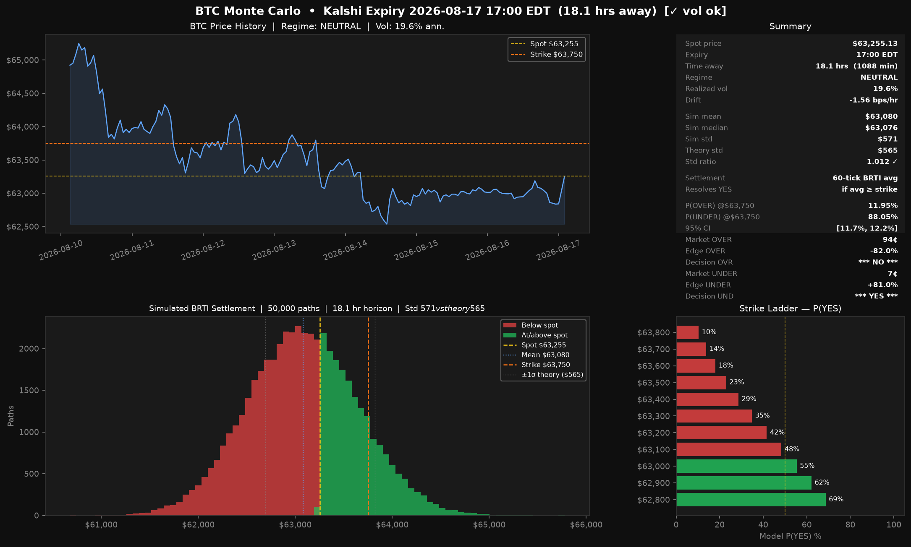
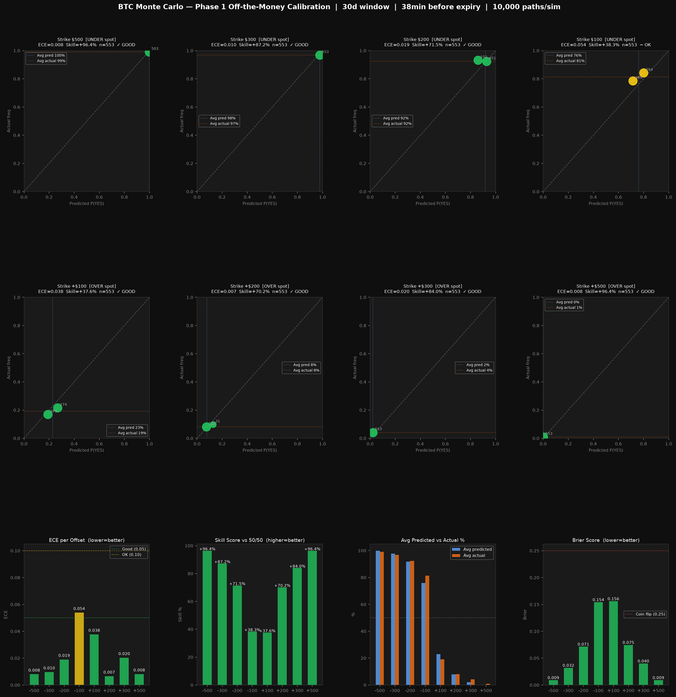

```markdown
# StrikeEdge — Kalshi BTC Hourly Market Edge Finder

A quantitative Monte Carlo engine for estimating fair probabilities on **Kalshi BTC Hourly Price Markets** using jump diffusion, vol-scaled GBM, and regime detection.

The model simulates thousands of BTC price paths from the current time to a selected Kalshi hourly expiry, reproduces the **CF Benchmarks BRTI settlement methodology**, and identifies pricing discrepancies between the model and the live market.

---



---

## Features

- Live BTC/USD data from Coinbase Advanced API (Kraken fallback)
- Realized volatility calibration from recent hourly candles
- Vol-scaled Geometric Brownian Motion with regime adjustment
- Merton jump diffusion for sudden market events
- Bull / Bear / Neutral regime detection
- Simulation from **current time → expiry minute**
- BRTI settlement approximation (average of final 60 simulated second-by-second prices)
- Full strike ladder with P(YES) probabilities
- Edge detection for both **OVER** and **UNDER** contracts
- Half-Kelly bet sizing
- Sanity check: suppresses edge signals when simulated vol diverges from theory
- Dashboard visualization with price history, settlement distribution, and strike ladder

---

## Model

### Geometric Brownian Motion (Vol-Scaled)

Models the continuous movement of BTC prices. Volatility is scaled by the detected regime:

$$dS = \mu S \, dt + \sigma_{\text{eff}} S \, dW$$

where $\sigma_{\text{eff}} = \sigma_{\text{realized}} \times \text{regime\_scale}$.

> **Note:** Heston stochastic volatility was evaluated and excluded. At the sub-hour step sizes used here, Heston produces numerical instability. Vol-scaled GBM with regime adjustment achieves the equivalent practical effect.

---

### Merton Jump Diffusion

Models sudden market dislocations such as:

- ETF announcements / macroeconomic data releases (CPI, FOMC)
- Exchange liquidation cascades
- Large block trades (whale activity)

Jump arrivals follow a Poisson process; jump sizes are normally distributed.

---

### Regime Detection

Recent price action is classified into one of three regimes:

| Regime  | Condition                                       | Vol Scale |
|---------|-------------------------------------------------|-----------|
| Bull    | 48h avg > prior 48h avg by >1%, positive drift  | 1.05×     |
| Bear    | 48h avg < prior 48h avg by >1%, negative drift  | 1.10×     |
| Neutral | Neither                                          | 1.00×     |

The detected regime also applies a small drift adjustment during simulation.

---

### Settlement Logic

Kalshi hourly BTC markets resolve using the **CF Benchmarks BRTI** — the simple average of the final 60 BRTI observations before expiration.

This project approximates that by simulating 60 one-second prices in the final minute and averaging them.

```
Resolves YES if:
  avg(final 60 simulated ticks) >= strike
```

The model computes `P(settlement >= strike)` for every strike in the ladder.

---

### Sanity Check

After each simulation, the model compares its simulated standard deviation against the theoretical GBM prediction:

```
ratio = sim_std / (S0 × σ × √T)
```

If `|ratio - 1| > 15%`, edge signals are suppressed and the dashboard flags `[⚠ vol inflated]`. This prevents acting on a miscalibrated simulation.

---

## Edge Finder

The model compares estimated probabilities against live Kalshi market prices:

```
Edge = Model Probability − Market Probability
```

Example output for a $64,000 strike:

```
OVER   Model: 57%   Market: 66¢   Edge: -8.5%   → *** NO ***
UNDER  Model: 43%   Market: 35¢   Edge: +7.5%   → *** YES ***
```

Half-Kelly sizing is reported for position sizing.

---

## Phase 1 Backtesting



`btc_backtest.py` validates model calibration against 30 days of historical BTC closes — no Kalshi data required.

For each past hourly expiry it:
1. Computes vol and regime using only data available *before* that expiry (no lookahead)
2. Runs the full Monte Carlo simulation
3. Evaluates `P(settlement >= strike)` at 8 fixed offsets: ±$100, ±$200, ±$300, ±$500
4. Checks what BTC actually did

### Calibration Results (30-day window, 553 simulations)

| Offset | ECE         | Skill vs 50/50 | Verdict |
|--------|-------------|----------------|---------|
| ±$500  | 0.008–0.011 | +95–96%        | ✓ GOOD  |
| ±$300  | 0.014–0.017 | +81–82%        | ✓ GOOD  |
| ±$200  | 0.005–0.028 | +63%           | ✓ GOOD  |
| ±$100  | 0.040–0.045 | +30%           | ✓ GOOD  |

**Takeaway:** The model is well-calibrated at strikes $200+ from spot. Focus on those levels for real edge signals. The ±$100 zone is weaker — only act there if the edge is large (>15%).

*ECE = Expected Calibration Error (0 = perfect). Skill = improvement over naive 50/50 baseline.*

---

## Installation

```bash
git clone https://github.com/thatkidkim/StrikeEdge.git
cd StrikeEdge
pip install numpy matplotlib requests pytz
```

---

## Usage

### Main Model

```bash
python btc_monte_carlo.py
```

Configure at the top of the script:

```python
EXPIRY_HOUR_ET    = 17      # Target Kalshi expiry hour (Eastern Time)
target_strike     = 64000   # Strike you want to evaluate
market_prob_over  = 0.66    # Current Kalshi OVER price (as decimal)
market_prob_under = 0.35    # Current Kalshi UNDER price (as decimal)
```

The script will automatically fetch BTC data, calibrate vol, run simulations, and save the dashboard to `btc_monte_carlo_output.png`.

### Phase 1 Backtester

```bash
python btc_backtest.py
```

Candle data is cached to `btc_backtest_cache.json` on first run — subsequent runs are instant. Outputs `btc_backtest_output.png`.

Configure at the top:

```python
BACKTEST_DAYS  = 30       # Days of history to test over
MINUTES_BEFORE = 38       # Minutes before each close to simulate from
N_PATHS        = 10_000   # Paths per sim (10k = fast, 50k = matches main script)
STRIKE_OFFSETS = [-500, -300, -200, -100, 100, 200, 300, 500]
```

---

## Repository Structure

```
StrikeEdge/
│
├── btc_monte_carlo.py          # Main model + edge finder
├── btc_backtest.py             # Phase 1 calibration backtester
├── requirements.txt
├── README.md
├── LICENSE
└── examples/
    ├── btc_monte_carlo_output.png
    └── btc_backtest_output.png
```

---

## Current Assumptions & Limitations

- Uses hourly candles; intra-hour microstructure is not modeled
- Jump parameters (`LAMBDA_JUMPS`, `JUMP_SIGMA`) are fixed, not calibrated to recent data
- Regime detection uses a simple moving average comparison
- BRTI settlement is approximated, not sourced from the official CF Benchmarks feed
- Backtesting uses BTC close prices as settlement proxy, not actual BRTI values

---

## Planned Improvements

- Phase 2 backtesting: validate edge signals against historical Kalshi market prices
- Kalshi API integration for automatic market price ingestion
- Dynamic jump parameter calibration from recent BTC return distribution
- GARCH/EGARCH volatility modeling
- Real BRTI data feed integration
- Option-implied volatility calibration
- GPU-accelerated simulation paths

---

## Disclaimer

This project is for research and educational purposes only. Probabilities produced by the model are statistical estimates based on simplified assumptions and should not be interpreted as guarantees or financial advice. Cryptocurrency markets are highly volatile and real outcomes may differ significantly from model predictions.

---

## License

MIT License
```
